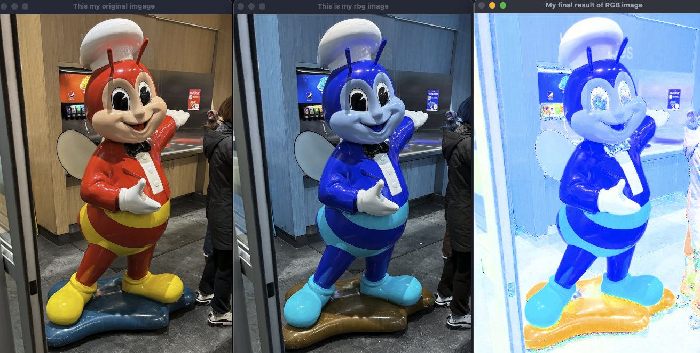

# Introduction to HSV Color Space and Image Processing with OpenCV

## Introduction to OpenCV 

This simple introduction to image processsing using OpenCV is focusing on the HSV color space. 
By creating a Python program that opens an image in RBG format then performs a conversion to the HSV color space. It will also set the V channel of all pixel to 255 (maximum brightness). It displays the results back in RBG. The V chanel is the value (V) in HSV. It represents the brightness or lightness of the color! This fun program explores the basics of using the OpenCV Library.

 


## How to run this simple program

### Prerequisites
Make sure you have Python installed on your system.

### Clone the Repository
```bash
git clone <repository-url>
cd <repository-directory>
```

## Install Dependencies
```bash
pip install opencv-python

```

## Run
```bash
python main.py

```

## Review Notes on Implementation Suggestions - Issues

- No need to BRG -> RBG as OpenCV does it for RBG automatically..... could go from original image to RGB TO HSV 

## This is the result of the program

